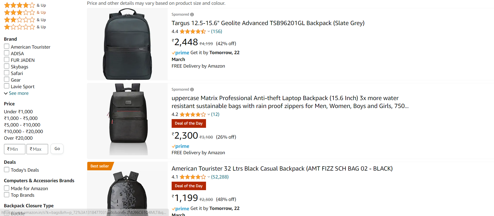

# Amazon_Web_Scrapping

This assignment involves scrapping data from a amazon shopping site web page
<a href='https://www.amazon.in/s?k=bags&crid=2M096C61O4MLT&qid=1653308124&sprefix=ba%2Caps%2C283&ref=sr_pg_1'>Amazon page URL</a>

The page looks as following: 

This page contains Information of backpag items on amazon website.

The things we are extracting are:

<ol>
<li>Product URL</li>
<li>Product Name</li>
<li>Product Price</li>
<li>Rating</li>
<li>Total number of Ratings</li>
<li>Number of Customer Reviews</li>
<li>Description</li>
<li>Manufacturer</li>
<li>ASIN</li>
<li>Product Description</li>
</ol>

The extracted information is stored in amazon_data.csv file

Note:-Extracting data upto 20 pages

